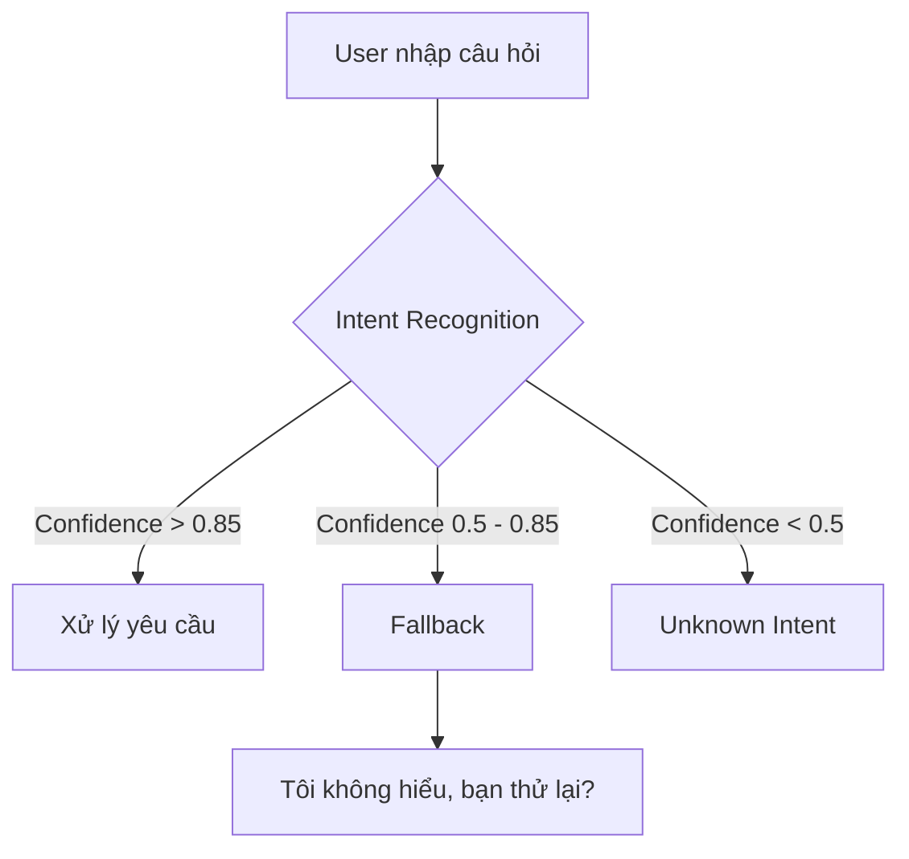
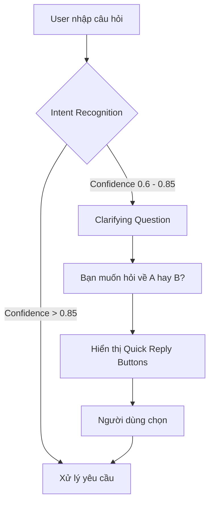

# Chatbot Moni (MoMo) – Phân Tích Điểm Yếu Trọng Yếu

## 1. Bối cảnh

Dựa trên phản hồi thực tế của người dùng, một trong những nguyên nhân lớn nhất làm giảm trải nghiệm sử dụng Chatbot Moni là khả năng xử lý các truy vấn có độ tin cậy trung bình (Low Confidence). Khi hệ thống không đủ tự tin để xác định ý định của người dùng, chatbot thường trả về các câu phản hồi chung chung như:

> "Tôi không hiểu, bạn thử lại?"

Điều này khiến người dùng phải nhập lại nhiều lần hoặc rời khỏi cuộc hội thoại.

---

## 2. Điểm Yếu Được Chọn

### Low-Confidence Fallback

Đây là điểm yếu có tác động lớn nhất đến trải nghiệm người dùng và được xác định là khu vực ưu tiên cải tiến.

### Hiện trạng

Khi mô hình NLP nhận diện ý định với độ tin cậy nằm trong khoảng trung bình, chatbot chuyển sang luồng fallback thay vì tiếp tục hỗ trợ người dùng.

### Tác động

- Người dùng phải nhập lại câu hỏi nhiều lần.
- Tăng tỷ lệ bỏ cuộc giữa chừng.
- Làm giảm mức độ tin tưởng vào chatbot.
- Tạo cảm giác chatbot "không thông minh" dù dữ liệu vẫn có thể xử lý được.

---

## 3. Nguyên Nhân

### Về mặt kỹ thuật

- Ngưỡng confidence được đặt quá cao (0.85).
- Không có cơ chế hỏi lại để làm rõ ý định.
- Thiếu các lựa chọn hỗ trợ khi chatbot không chắc chắn.
- Toàn bộ trường hợp không rõ ràng đều bị đẩy vào cùng một luồng fallback.

---

## 4. Đề Xuất Cải Tiến

Thay vì trả về thông báo lỗi ngay lập tức, chatbot nên chủ động hỏi lại người dùng bằng các lựa chọn cụ thể.

### Luồng đề xuất

### Ví dụ

**User:**

> Tháng này tôi tốn bao nhiêu?

**Chatbot hiện tại:**

> Tôi không hiểu, bạn thử lại?

**Chatbot sau cải tiến:**

> Bạn muốn xem:
>
> - Chi tiêu tháng này
> - Thu nhập tháng này
> - Báo cáo tài chính

Người dùng chỉ cần chọn một lựa chọn để tiếp tục.

---

## 5. Lợi Ích Kỳ Vọng

| Chỉ số | Hiện tại | Mục tiêu |
|---------|----------|-----------|
| Low-confidence fallback rate | ~30% | <10% |
| Tỷ lệ bỏ cuộc sau fallback | ~45% | <20% |
| Số lượt tương tác để hoàn thành tác vụ | 3.2 | 1.8 |
| Tỷ lệ đánh giá tiêu cực | ~25% | <12% |

---

## 6. Kết Luận

Điểm yếu nghiêm trọng nhất trong flow hiện tại của Chatbot Moni là cơ chế **Low-Confidence Fallback**. Thay vì hỗ trợ người dùng làm rõ ý định, hệ thống đang trả về các phản hồi chung chung dẫn đến tỷ lệ bỏ cuộc cao.

Giải pháp ưu tiên là triển khai **Clarifying Question kết hợp Quick Reply Buttons**, giúp chatbot chuyển từ cơ chế "không hiểu" sang cơ chế "hỏi lại thông minh". Đây là thay đổi có chi phí triển khai tương đối thấp nhưng mang lại tác động lớn nhất đến trải nghiệm người dùng.