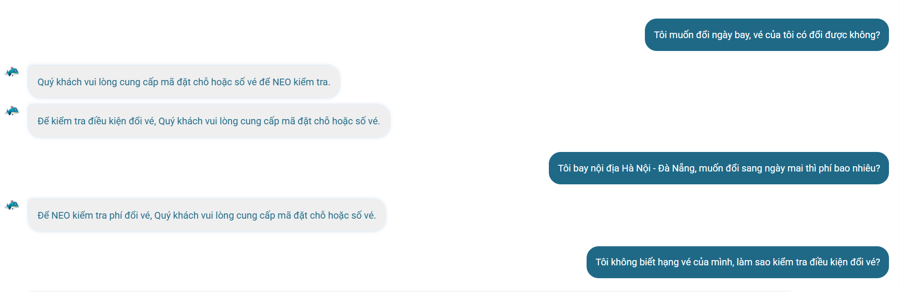
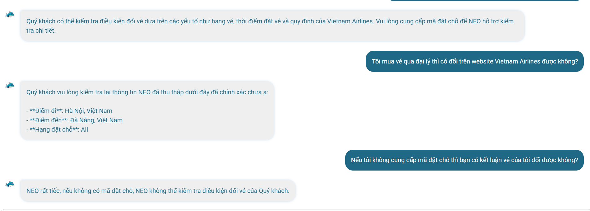

# Workshop - Mổ App AI Thật

**Họ tên:** Phạm Ngọc Hải Dương  
**Sản phẩm chọn:** Vietnam Airlines - NEO  
**Workflow teardown:** Hành khách đã mua vé và muốn đổi ngày bay  
**Output:** finding note + sketch `as-is / to-be`

## 1. Chọn một sản phẩm để dùng thử

| Sản phẩm | AI feature | Cách truy cập |
| --- | --- | --- |
| Vietnam Airlines - NEO | Chatbot hỗ trợ vé, hành lý, chuyến bay, thanh toán, hoàn/đổi vé | Website Vietnam Airlines hoặc Zalo VNA |

**Workflow chọn:** User đã mua vé Vietnam Airlines và muốn đổi ngày bay.

**Lý do chọn:** Đổi ngày bay nghe như một câu hỏi đơn giản, nhưng câu trả lời đúng phụ thuộc vào mã đặt chỗ, số vé, điều kiện giá, hạng vé, kênh mua vé và thời điểm đổi vé. Đây là workflow tốt để kiểm tra xem NEO có biết hỏi lại khi thiếu thông tin, và có xử lý đúng khi user chuyển ngữ cảnh hay không.

## 2. Dùng thử: promise vs reality

**Product hứa gì?**

Vietnam Airlines giới thiệu NEO là trợ lý ảo hỗ trợ 24/7 cho các thắc mắc liên quan đến hành trình, mua vé, thanh toán, chuyến bay và hành lý. Với những câu hỏi NEO chưa thể giải đáp, hành khách được chuyển hướng gặp tư vấn viên.

Nguồn tham chiếu:

- https://www.vietnamairlines.com/in/vi/support/chatbot
- https://www.vietnamairlines.com/at/vi/support/condition-of-chatbot-NEO

**User nào được hứa sẽ được giúp?**

User là hành khách đã mua vé Vietnam Airlines và cần đổi ngày bay. User muốn biết vé có đổi được không, phí đổi là bao nhiêu, cần đổi ở đâu, và nếu mua qua đại lý thì có đổi được trên website Vietnam Airlines không.

**Kỳ vọng AI làm được task nào?**

NEO nên nhận ra intent "đổi vé / thay đổi chuyến bay", hỏi lại thông tin còn thiếu trước khi kết luận, hướng dẫn user kiểm tra điều kiện vé, đưa bước tiếp theo rõ ràng, hoặc chuyển tư vấn viên nếu không đủ dữ liệu.

**Reality quan sát được**

NEO xử lý tốt khi thiếu mã đặt chỗ: bot yêu cầu user cung cấp mã đặt chỗ hoặc số vé, không kết luận vội điều kiện đổi vé. Tuy nhiên, điểm gãy xuất hiện khi user hỏi về vé mua qua đại lý. NEO không trả lời câu hỏi "có đổi trên website Vietnam Airlines được không", mà kéo ngữ cảnh về chặng Hà Nội - Đà Nẵng và hiển thị lại thông tin đã thu thập.

**Screenshot evidence**





**Prompt/input đã thử và hành vi quan sát được**

| Prompt | Phản hồi của NEO | Observation |
| --- | --- | --- |
| "Tôi muốn đổi ngày bay, vé của tôi có đổi được không?" | "Quý khách vui lòng cung cấp mã đặt chỗ hoặc số vé để NEO kiểm tra." / "Để kiểm tra điều kiện đổi vé, Quý khách vui lòng cung cấp mã đặt chỗ hoặc số vé." | NEO nhận đúng intent đổi vé và hỏi lại dữ liệu booking. |
| "Tôi bay nội địa Hà Nội - Đà Nẵng, muốn đổi sang ngày mai thì phí bao nhiêu?" | "Để NEO kiểm tra phí đổi vé, Quý khách vui lòng cung cấp mã đặt chỗ hoặc số vé." | Bot không trả phí cụ thể khi thiếu mã đặt chỗ, nhưng chưa giải thích rõ phí phụ thuộc điều kiện giá/chênh lệch giá. |
| "Tôi không biết hạng vé của mình, làm sao kiểm tra điều kiện đổi vé?" | "Quý khách có thể kiểm tra điều kiện đổi vé dựa trên các yếu tố như hạng vé, thời điểm đặt vé và quy định của Vietnam Airlines. Vui lòng cung cấp mã đặt chỗ để NEO hỗ trợ kiểm tra chi tiết." | Bot nêu yếu tố ảnh hưởng nhưng chưa hướng dẫn user tìm hạng vé ở đâu. |
| "Tôi mua vé qua đại lý thì có đổi trên website Vietnam Airlines được không?" | "Quý khách vui lòng kiểm tra lại thông tin NEO đã thu thập dưới đây đã chính xác chưa ạ: Điểm đi: Hà Nội; Điểm đến: Đà Nẵng; Hạng đặt chỗ: All." | Điểm gãy chính: NEO không xử lý intent mới về kênh mua vé qua đại lý. |
| "Nếu tôi không cung cấp mã đặt chỗ thì bạn có kết luận vé của tôi đổi được không?" | "NEO rất tiếc, nếu không có mã đặt chỗ, NEO không thể kiểm tra điều kiện đổi vé của Quý khách." | NEO xử lý tốt low-confidence path. |

## 3. Vẽ 4 paths

**Happy path - AI đúng intent**

```text
User:
"Tôi muốn đổi ngày bay, vé của tôi có đổi được không?"

NEO:
Nhận ra intent = đổi vé / đổi ngày bay

NEO:
Yêu cầu mã đặt chỗ hoặc số vé để kiểm tra

User thấy:
NEO không trả lời bừa, biết cần dữ liệu booking trước khi kết luận.

Status:
Một phần đạt. Chưa kiểm chứng full happy path vì không cung cấp mã đặt chỗ thật.
```

**Low-confidence path - AI không chắc vì thiếu dữ liệu**

```text
User:
"Nếu tôi không cung cấp mã đặt chỗ thì bạn có kết luận vé của tôi đổi được không?"

NEO:
"NEO rất tiếc, nếu không có mã đặt chỗ, NEO không thể kiểm tra điều kiện đổi vé của Quý khách."

User thấy:
Bot nói rõ giới hạn, không kết luận chắc chắn khi thiếu mã đặt chỗ.

Status:
Đạt. Đây là low-confidence path tốt.
```

**Failure path - AI trả lời thiếu phần giải thích/recovery**

```text
User:
"Tôi bay nội địa Hà Nội - Đà Nẵng, muốn đổi sang ngày mai thì phí bao nhiêu?"

NEO:
"Để NEO kiểm tra phí đổi vé, Quý khách vui lòng cung cấp mã đặt chỗ hoặc số vé."

Điểm gãy:
NEO không trả lời sai, nhưng câu trả lời thiếu giải thích vì sao cần mã đặt chỗ.
Bot cũng chưa nói rõ phí đổi vé phụ thuộc vào điều kiện giá, hạng vé và chênh lệch giá.

User thấy:
User biết cần mã đặt chỗ, nhưng chưa hiểu logic tính phí và chưa có bước thay thế nếu không có mã đặt chỗ ngay.

Status:
Một phần đạt, nhưng UX recovery còn yếu.
```

**Correction path - user đổi/ngắt ngữ cảnh**

```text
User:
"Tôi mua vé qua đại lý thì có đổi trên website Vietnam Airlines được không?"

NEO:
"Quý khách vui lòng kiểm tra lại thông tin NEO đã thu thập dưới đây đã chính xác chưa ạ:
- Điểm đi: Hà Nội, Việt Nam
- Điểm đến: Đà Nẵng, Việt Nam
- Hạng đặt chỗ: All"

Điểm gãy:
User đang hỏi intent mới về kênh mua vé qua đại lý.
NEO không cập nhật intent mà quay lại ngữ cảnh chặng bay đã thu thập trước đó.

User thấy:
User vẫn không biết vé mua qua đại lý có đổi được trên website hay phải liên hệ đại lý.

Status:
Không đạt. Đây là path gãy chính của workflow.
```

## 4. Viết finding thành quyết định

```text
Khi user đang hỏi về đổi ngày bay rồi chuyển sang câu "Tôi mua vé qua đại lý thì có đổi trên website Vietnam Airlines được không?",
NEO không nhận ra đây là intent mới về kênh mua vé/đổi vé, mà hiển thị lại thông tin chặng bay đã thu thập trước đó như điểm đi, điểm đến và hạng đặt chỗ "All",
hậu quả là user không biết vé mua qua đại lý có đổi được trên website Vietnam Airlines hay phải liên hệ đại lý, dẫn đến nguy cơ đi sai kênh hỗ trợ và mất thời gian xử lý.
Lỗi thuộc layer Intent + Context Management + UX Recovery.
Nên sửa bằng correction path: khi user bổ sung thông tin về kênh mua vé như "mua qua đại lý", NEO phải cập nhật intent sang "đổi vé theo kênh mua", trả lời trực tiếp các lựa chọn xử lý, hoặc hỏi xác nhận nếu không chắc. Nếu không đủ thông tin, NEO nên chuyển tư vấn viên thay vì chỉ lặp lại thông tin chặng bay.
```

**Câu đổi SPEC:**

```text
SPEC cần thêm requirement cho context-switch trong workflow đổi vé: nếu user bổ sung thông tin về kênh mua vé như "mua qua đại lý", NEO phải chuyển intent sang "đổi vé theo kênh mua" và trả lời trực tiếp website/đại lý/tư vấn viên, thay vì chỉ lặp lại thông tin chặng bay đã thu thập.
```

## 5. Sketch as-is / to-be

| As-is | To-be |
| --- | --- |
| User hỏi: "Vé của tôi có đổi ngày bay được không?" | User hỏi: "Vé của tôi có đổi ngày bay được không?" |
| NEO yêu cầu mã đặt chỗ hoặc số vé. | NEO yêu cầu mã đặt chỗ hoặc số vé. |
| User hỏi tiếp: "Tôi bay nội địa Hà Nội - Đà Nẵng, muốn đổi sang ngày mai thì phí bao nhiêu?" | NEO nói rõ: cần mã đặt chỗ/số vé vì phí đổi phụ thuộc điều kiện giá, hạng vé và chênh lệch giá. |
| NEO tiếp tục yêu cầu mã đặt chỗ hoặc số vé. | User hỏi: "Tôi mua vé qua đại lý thì có đổi trên website Vietnam Airlines được không?" |
| User hỏi: "Tôi mua vé qua đại lý thì có đổi trên website Vietnam Airlines được không?" | NEO nhận ra intent mới là kênh mua vé. |
| NEO hiển thị lại thông tin đã thu thập: điểm đi Hà Nội, điểm đến Đà Nẵng, hạng đặt chỗ All. | NEO trả lời trực tiếp: vé mua qua đại lý có thể cần xử lý qua đại lý phát hành vé; nếu không chắc, hỏi thêm mã đặt chỗ/số vé hoặc chuyển tư vấn viên. |
| Điểm gãy: user vẫn không biết vé mua qua đại lý có đổi được trên website không. | Recovery: user có bước tiếp theo rõ ràng: kiểm tra điều kiện vé, liên hệ đại lý, hoặc gặp tư vấn viên. |

## 6. Tự kiểm trước khi nộp

- [x] Có ít nhất 1 screenshot hoặc observation cụ thể.
- [x] Có đủ 4 paths hoặc nói rõ path nào chưa có trong product.
- [x] Finding được viết thành product decision, không chỉ là nhận xét.
- [x] Sketch có as-is và to-be.
- [x] Có một câu nói rõ finding này sẽ đổi gì trong SPEC.
